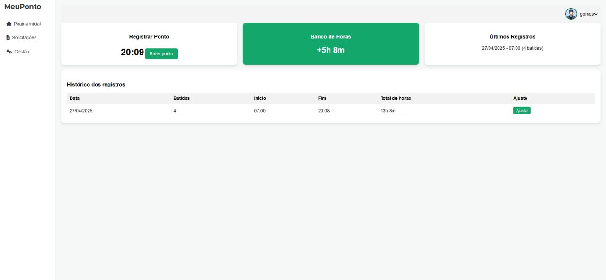
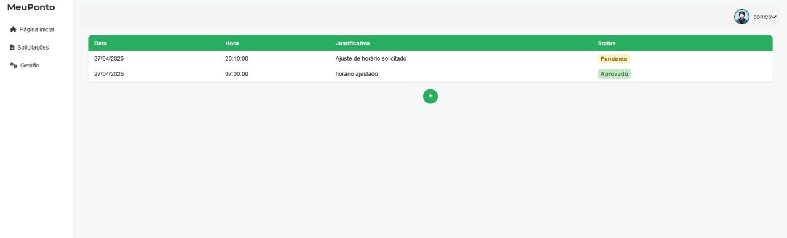
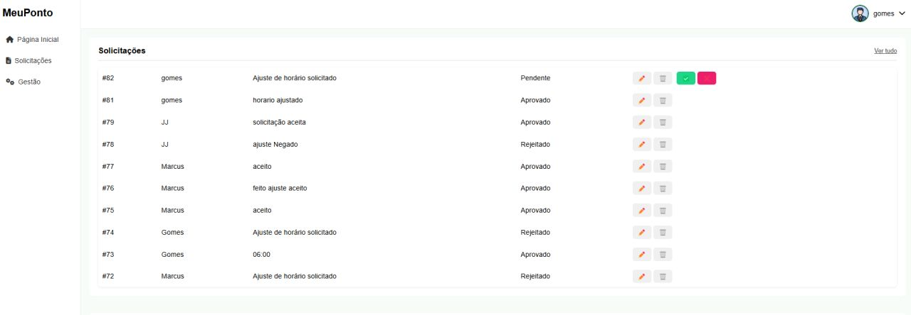
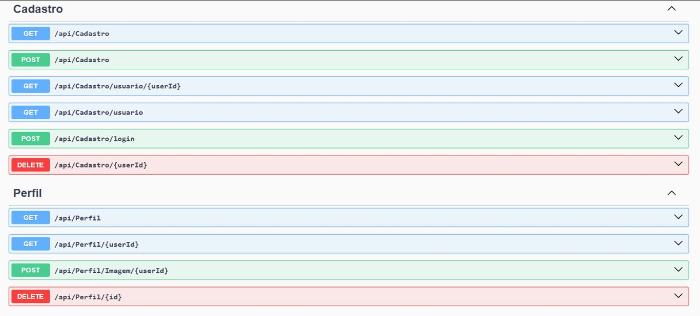
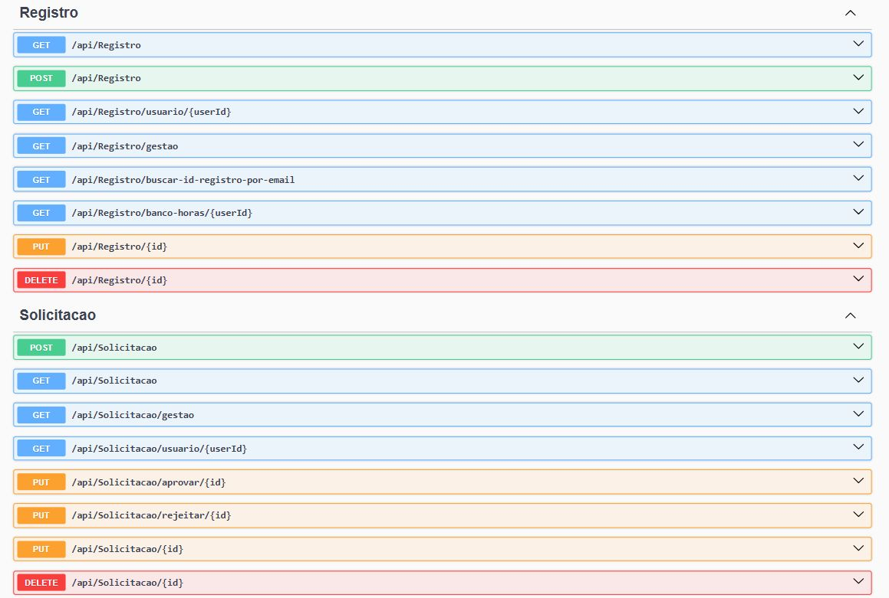

# ⏱️ MeuPonto — Gestão de Banco de Horas

Aplicação prática de C# em um projeto acadêmico: uma **API RESTful para gerenciamento de banco de horas** dentro de uma empresa, com fluxo completo de solicitação e aprovação de ajustes de ponto.

## Funcionalidades

- 🎯 Cadastro e autenticação de funcionários
- 🎯 Registro de horas trabalhadas (bater ponto)
- 🎯 Controle de banco de horas, incluindo cálculo de horas extras
- 🎯 Solicitação e acompanhamento de ajustes de horário
- 🎯 Fluxo de aprovação: funcionários solicitam alterações no ponto, e um gestor aprova ou rejeita cada solicitação

## Tecnologias

- **C#** / **ASP.NET Core**
- **SQL Server** como banco de dados
- Arquitetura em camadas (Controllers → Service → Interface → Database)

## Endpoints da API

### Cadastro

| Método | Rota | Descrição |
|---|---|---|
| `POST` | `/api/Cadastro` | Cadastra um novo funcionário |
| `GET` | `/api/Cadastro` | Lista funcionários cadastrados |
| `GET` | `/api/Cadastro/usuario/{userId}` | Busca cadastro por ID |
| `POST` | `/api/Cadastro/login` | Autentica um funcionário |
| `DELETE` | `/api/Cadastro/{userId}` | Remove um cadastro |

### Perfil

| Método | Rota | Descrição |
|---|---|---|
| `GET` | `/api/Perfil` | Lista perfis |
| `GET` | `/api/Perfil/{userId}` | Busca perfil por ID |
| `POST` | `/api/Perfil/Imagem/{userId}` | Envia foto de perfil |
| `DELETE` | `/api/Perfil/{id}` | Remove um perfil |

### Registro (ponto)

| Método | Rota | Descrição |
|---|---|---|
| `POST` | `/api/Registro` | Registra uma batida de ponto |
| `GET` | `/api/Registro` | Lista registros |
| `GET` | `/api/Registro/usuario/{userId}` | Registros de um funcionário |
| `GET` | `/api/Registro/gestao` | Visão de gestão dos registros |
| `GET` | `/api/Registro/banco-horas/{userId}` | Consulta o banco de horas |
| `PUT` | `/api/Registro/{id}` | Atualiza um registro |
| `DELETE` | `/api/Registro/{id}` | Remove um registro |

### Solicitação (ajustes)

| Método | Rota | Descrição |
|---|---|---|
| `POST` | `/api/Solicitacao` | Abre uma solicitação de ajuste |
| `GET` | `/api/Solicitacao` | Lista solicitações |
| `GET` | `/api/Solicitacao/gestao` | Fila de solicitações pendentes de aprovação |
| `GET` | `/api/Solicitacao/usuario/{userId}` | Solicitações de um funcionário |
| `PUT` | `/api/Solicitacao/aprovar/{id}` | Aprova uma solicitação |
| `PUT` | `/api/Solicitacao/rejeitar/{id}` | Rejeita uma solicitação |
| `DELETE` | `/api/Solicitacao/{id}` | Remove uma solicitação |

## Capturas de tela

> Os dados exibidos nos prints são fictícios, criados exclusivamente para demonstração.

**Página inicial: bater ponto e ver o banco de horas em tempo real**


**Minhas solicitações de ajuste, com status de aprovação**


**Painel de gestão: aprovação/rejeição das solicitações da equipe**


**Documentação dos endpoints — Cadastro e Perfil**


**Documentação dos endpoints — Registro e Solicitação**


## Estrutura do projeto

```
MeuPontoMongoDb/
├── Controllers/     # CadastroController, PerfilController, RegistroController, SolicitacaoController
├── Database/         # AppDbContext
├── Interface/         # contratos dos serviços (ICadastroService, IPerfilService, IRegistroService, ISolicitacaoService)
├── Models/
│   ├── DTO/            # ImagemUploadDto, RegistroComEmailDTO, SolicitarGestaoDTO
│   └── ...              # Enum, BancoHoras, Cadastro, Perfil, Registro, Solicitacao
├── Service/            # regras de negócio (CadastroService, PerfilService, RegistroService, SolicitacaoService)
├── Utils/              # CalculoTrabalho, DataHoraHelper, PasswordHasher
├── Migrations/
└── Program.cs
```

## Aprendizados

Este projeto ajudou a colocar em prática o desenvolvimento de APIs com C# e .NET, trabalhar com banco de dados e lidar com controle de acesso e fluxo de aprovação de solicitações — do cadastro de funcionários até a análise das horas trabalhadas por um gestor.

## Contato

- LinkedIn: [Marcus Vinicius Gomes](https://www.linkedin.com/in/marcus-vinicius-gomes-226552249/)
- GitHub: [@MarcusGomesp](https://github.com/MarcusGomesp)
